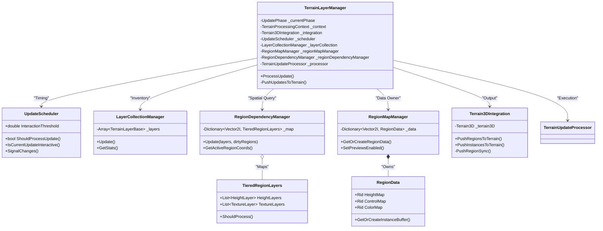
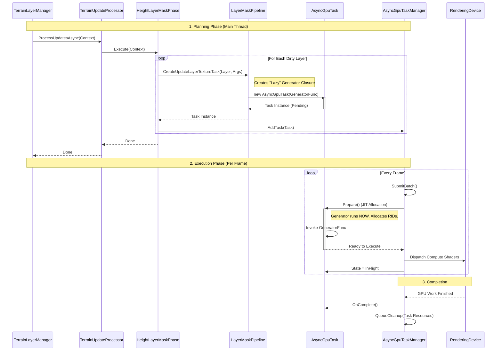
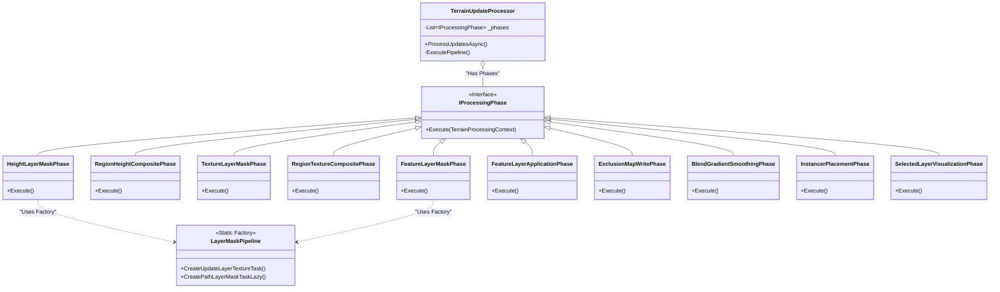
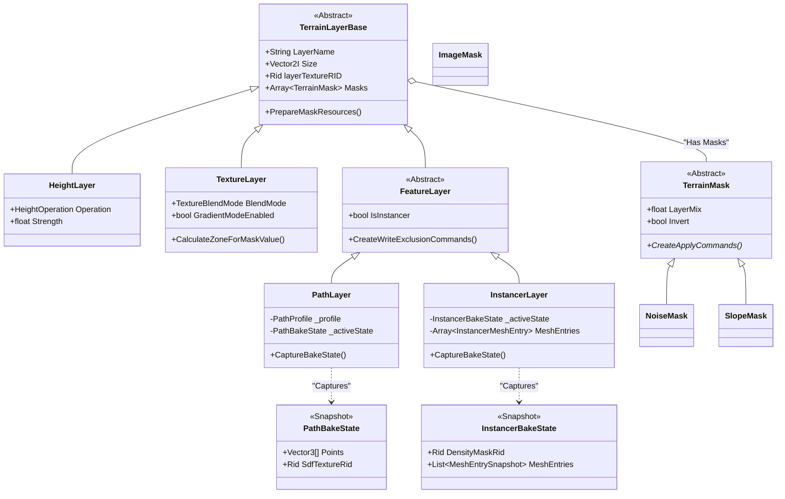
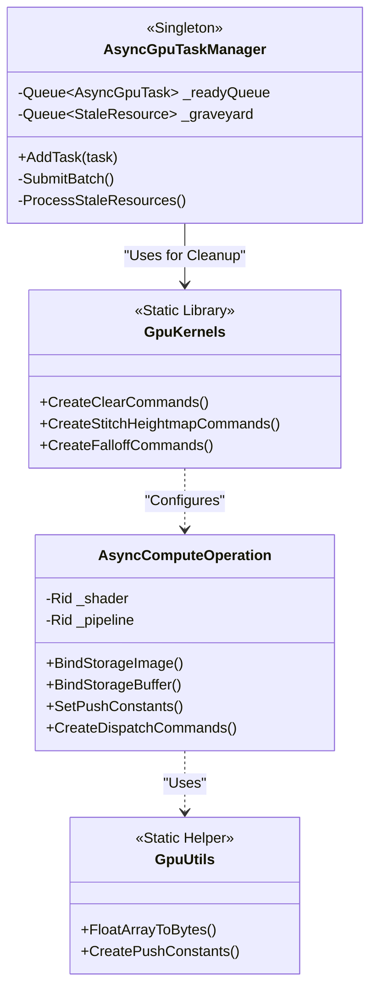

# Terrain 3D Tools - Architecture UML Documentation

## 1. System Architecture (The "Big Picture")
This diagram illustrates the static structure of the system, showing how the central manager orchestrates its subsystems and data.

## 2. Task Creation & Execution Flow (Sequence Diagram)
This diagram demonstrates the **Just-In-Time (JIT)** allocation pattern where expensive GPU resources are only created when the task manager is ready to execute them.

## 3. Pipeline & Phase Hierarchy
Details the `TerrainUpdateProcessor` and its specific phases.

## 4. Layer & Mask Data System
Inheritance hierarchy for Layers and Masks, including thread-safe state snapshots.

## 5. GPU Abstraction Layer
Low-level utility classes for the RenderingDevice interface.

